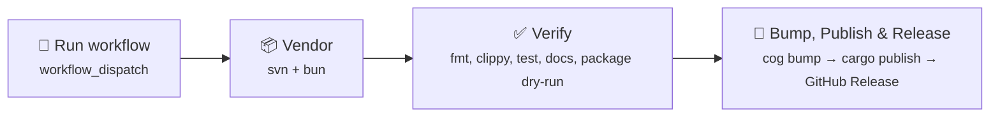

# Publishing Guide

This document describes the release workflow for `wow-windmedia`.

## How It Works

Releases are fully automated via cocogitto + GitHub Actions:

1. Merge PR to `main` with conventional commits
2. Go to **Actions → Release → Run workflow**
3. Select bump type: `auto` (recommended), `major`, `minor`, `patch`, or explicit version
4. CI verifies everything, then automatically:
   - Bumps `Cargo.toml` version via `cargo set-version`
   - Creates a git tag (e.g. `0.2.0`)
   - Generates `CHANGELOG.md` from conventional commits
   - Publishes to [crates.io](https://crates.io/crates/wow-windmedia)
   - Creates a GitHub Release with the changelog

**No manual version editing. No manual tag pushing. No manual `cargo publish`.**

## Bump Types

| Input   | Behavior                                                         |
| ------- | ---------------------------------------------------------------- |
| `auto`  | Analyzes commits since last tag, picks semver bump automatically |
| `patch` | `0.1.0` → `0.1.1`                                                |
| `minor` | `0.1.0` → `0.2.0`                                                |
| `major` | `0.1.0` → `1.0.0`                                                |
| `1.2.3` | Set exact version                                                |

## Prerequisites

The following must be configured in the repository:

| Secret                 | Purpose                                      |
| ---------------------- | -------------------------------------------- |
| `CARGO_REGISTRY_TOKEN` | crates.io publish token                      |
| `GITHUB_TOKEN`         | Auto-provided by GitHub Actions for tag push |

A `release` environment must exist in **Settings → Environments** with the `CARGO_REGISTRY_TOKEN` secret.

## Release Flow Detail



### Verify Job

Runs the same checks as CI:

- `cargo fmt --all --check`
- `stylua --check templates/*.lua`
- `cargo clippy -p wow-windmedia --all-targets -- -D warnings`
- `cargo test -p wow-windmedia`
- `cargo doc -p wow-windmedia --no-deps`
- `cargo publish -p wow-windmedia --dry-run --allow-dirty`

### Release Job

1. `cog bump <type>` — analyzes commits, runs `pre_bump_hooks`:
   - `cargo set-version {{version}}` — updates `Cargo.toml`
   - `git add :/Cargo.toml` — stages the change
   - Creates commit + tag
2. `cog changelog --at <version>` — generates changelog
3. `cargo publish -p wow-windmedia` — publishes to crates.io
4. Creates GitHub Release with changelog body

### Post-bump Hooks

After the tag is created, cocogitto runs `post_bump_hooks` from `cog.toml`:

- `git push` — push the version bump commit
- `git push origin <version>` — push the tag

## Versioning Policy

Until `1.0.0`:

- **Patch releases** (`0.x.y` → `0.x.(y+1)`) — bug fixes, small polish
- **Minor releases** (`0.x.y` → `0.(x+1).0`) — meaningful API additions
- Avoid breaking changes without a minor bump

## Post-Release Verification

After a release:

- Confirm the crate appears on [crates.io](https://crates.io/crates/wow-windmedia)
- Confirm [docs.rs](https://docs.rs/wow-windmedia) built successfully
- Verify the GitHub Release renders the changelog correctly

## Troubleshooting

### "No conventional commits found"

Cocogitto needs commits with conventional prefixes (`feat:`, `fix:`, etc.) since the last tag. If the last release was `0.1.0` and no new conventional commits exist, `cog bump auto` will fail. Use an explicit version instead:

```
Bump type: 0.1.1
```

### Publish fails with "already uploaded"

The version already exists on crates.io. You need to bump to a higher version.

### Verify fails

Run the checks locally before triggering the release:

```bash
bun install && bun run update-vendor
cargo fmt --all --check
cargo clippy -p wow-windmedia --all-targets -- -D warnings
cargo test -p wow-windmedia
cargo publish -p wow-windmedia --dry-run --allow-dirty
```
